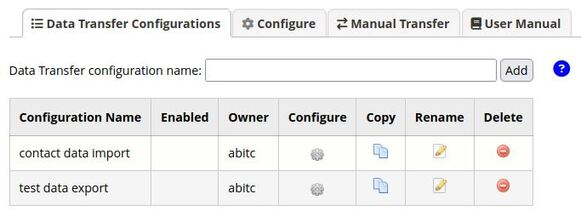
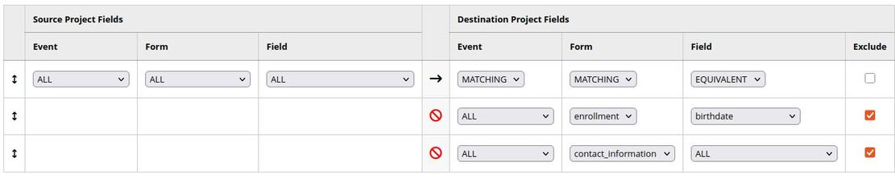
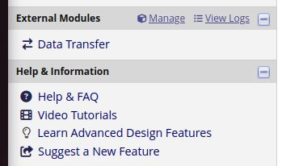

<!--
Copyright (C) 2025 The Trustees of Indiana University
SPDX-License-Identifier: BSD-3-Clause
-->

Data Transfer External Module
=======================================

Data Transfer is a REDCap external module that transfers data between REDCap projects.

Data Transfer has the following main features:

* **Local and Remote Transfers.** Data can be transferred between projects on the same REDCap
    instance, or on different REDCap instances using API tokens for REDCap's API (Application Programming Interface).

* **Imports and Exports.** Data can be imported to a project, or exported from a project.

* **Manual, Scheduled and Form Save Transfers.** Data transfers can be activated in the following ways:
    * **Manually.** 
    * **Scheduled.** Data transfers can be scheduled to run recurringly on an hourly, daily or weekly basis.
    * **On Form Save.** Data transfer can be configured to run automatically when a form is saved.

* **Custom User Interface.** Data Transfer provides a custom user interface instead of using REDCap's
    built-in external module configuration interface. This allows more flexibility in providing
    a user-friendly interface, including:

    * **Configuration Management.** You can create multiple data transfer configurations per project, and
        a page is provided that allows you to copy, rename and delete them.

        

    * **Flexible Field Mapping - Wildcards and Exclusions.** Data transfer supports wildcard event, form, and field specifications when
        mapping the fields transferred from one project to another. Data transfer also supports the specification of the exclusion
        of fields from data transfers. These 2 features allows users to minimize the fields mappings that need
        to be specified for a data transfer.

        

    * **Project Comparison Page.** A page is provided that compares the two projects of the data transfer.
        This can be helpful when figuring out how to map the fields between projects.

* **Dynamic Permission Checks.** Data Transfer checks user permissions every time data is transferred, and not just when the external
      module is initially configured. This is important, because user project permissions can change over time.

Accessing the Data Transfer External Module
----------------------------------------------

To access the Data Transfer external module, click on
the **Data Transfer** link in the **External Modules**
section of the menu on the left of a project page.

If the link does not appear, then it means that the Data Transfer
external module has not yet been enabled for the project. If your admin set
up this external module so that users can enable it, then you can do this
on the page you get to by clicking on the **Manage** link under the
**External Modules** section. If you are not able to enable this
module, then you will need to request that your admin enable it.

Using the Data Transfer External Module
------------------------------------------

For information on how to use the Data Transfer external module, see the **User Manual**
and **help** included in the external module.
Help is accessed by clicking on the help icons:

Limitations
---------------

**Action Tags.** Action tags processing is limited. The only action tag that is currently
processed is the @NOMISSING tag (in regard to missing data codes), however, there are
other action tags (e.g., @CHARLIMIT and @WORDLIMIT) that could affect the compatibility
between source and destination fields.

